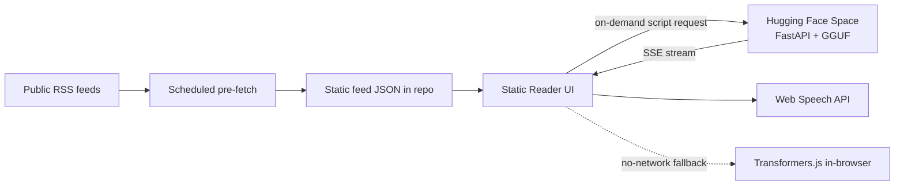
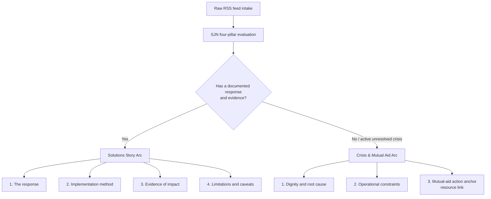

# Phase 0 — Foundation

Phase 0 is a planning phase. It establishes the architectural foundation, the
data and anti-hallucination protocols, the editorial taxonomy, and the
zero-cost execution model **before** any application code is written or any
cloud instance is provisioned. Nothing in this document deploys a service or
downloads a model; it records decisions, the assumptions behind them, and the
checks that Phase 1 must run before those assumptions can be relied on.

## 1. Objective and scope

audio-news turns public RSS feeds into short, spoken, action-oriented news
segments. It reframes inverted-pyramid crisis reporting into either a
solutions-journalism arc or a crisis-and-mutual-aid arc, and reads the result
aloud through the browser's own speech synthesis.

Phase 0 delivers:

- An architectural blueprint and a shortlist of candidate local models, with the
  assumptions each choice depends on.
- A strict anti-hallucination protocol (extractive-only context, deterministic
  sampling, and link lineage).
- An editorial taxonomy: the Solutions Journalism Network (SJN) reframing
  protocol and a geography/perspective feed registry.
- A zero-cost execution model (scale-to-zero server with an in-browser
  fallback).
- A validation checklist that Phase 1 must clear.

Phase 0 explicitly does **not** deliver running code, a deployed Space, or any
claim that a specific feed, model, or Space configuration works in production.
Those are Phase 1 verification tasks and are marked as such below.

## 2. Architectural blueprint

```
[ FRONTEND ]                         [ DEPLOYMENT & SYNC ]          [ BACKEND COMPUTATION ]
Static Reader UI  <----------------- GitHub Repository -----------> Hugging Face Space
(HTML/CSS/JS + TTS)                  (Git source / Actions)         (FastAPI + GGUF local LLM)
       |                                                                    |
       +--- Reads pre-fetched RSS JSON <--- Cron pre-fetch -----------------+
       +--- Sends on-demand requests ----> Server-Sent Events (SSE) / MCP --+
```



### Runtime engine: scale-to-zero

- **Hosting.** A single Hugging Face Space runs a Python 3.10 FastAPI backend
  and serves the static frontend from a `/static` directory.
- **Execution.** The Space is set to scale to zero after a short idle window
  (the specification proposes 15 minutes). A request cold-starts the Space,
  generates, and lets it sleep again, so the platform bills no idle time.
- **In-browser fallback.** Where the visitor's hardware allows, the reader can
  fall back to Transformers.js (v3) running a small instruction model in the
  browser through WebGPU / ONNX Runtime. This keeps a usable path when the Space
  is cold, rate-limited, or unavailable, and keeps a local-first default.

The server is the convenience path and the browser is the resilient one; that
relationship must stay visible to the user. See
[ADR 0001](decisions/0001-scale-to-zero-and-anti-hallucination.md).

### Candidate models

Low-footprint quantized (Q4_K_M) open-weight models for fast inference on a free
CPU or ZeroGPU tier. These are candidates to benchmark in Phase 1, not a final
choice.

| Model | Context window | Approx. size (GGUF) | Why it is a candidate |
| --- | --- | --- | --- |
| Qwen2.5-1.5B-Instruct (proposed default) | 32,768 tokens | ~1.1 GB | Strong instruction-following; reliable JSON and structural formatting. |
| Llama-3.2-3B-Instruct | 128,000 tokens | ~2.0 GB | More expressive narrative voice for broadcast styling. |
| SmolLM2-1.7B-Instruct | 8,192 tokens | ~1.0 GB | Fast cold-start on low-spec CPUs. |

Sizes and context windows are as published by the model authors and must be
re-checked against the exact GGUF quantization and Space tier in Phase 1. Model
licences must be confirmed compatible with this project's licence before any
weights are bundled or auto-downloaded.

## 3. Solutions journalism and crisis reframing protocol

The script generator applies the Solutions Journalism Network four-pillar
framework, routing each story to one of two arcs.



- **Solutions Story Arc** applies when the source entry itself documents a
  response, a method, and evidence of impact — and states its limitations.
- **Crisis & Mutual Aid Arc** applies to an active, unresolved crisis. It leads
  with dignity and root cause, names operational constraints, and ends on a
  concrete mutual-aid action anchored to a resource link **carried from the
  source entry**, never invented.

The routing decision and the arc content are both bounded by the
anti-hallucination controls in the next section: an arc is only as complete as
the source entry supports, and missing pillars are dropped rather than filled.

## 4. Anti-hallucination protocol

These controls are the non-negotiable boundary of the project.

- **Extractive-only context.** The system prompt forbids the model from using
  pre-trained external knowledge. Any statement not present in the RSS entry is
  dropped. The model summarizes and restructures supplied text; it does not add
  facts.
- **Deterministic sampling.** Classification and script synthesis run at
  `temperature = 0.0` and `top_p = 1.0` so the same entry yields the same script.
  This is what makes a spoken segment reproducible and reviewable.
- **Link lineage.** URLs are extracted in Python with `feedparser` and stored in
  the frontend payload. The model is prohibited from emitting HTML or rendering
  links, which removes the most common surface for URL hallucination. The UI, not
  the model, attaches the source and resource links.
- **No numeric or causal invention.** The script must not introduce a number,
  date, or causal claim that is not present in the source entry. Numbers spoken
  aloud are especially hard for a listener to verify, so this check matters more
  here than on screen.

A failure of any control must degrade safely: a segment that cannot be produced
within these bounds is skipped and reported, never guessed.

## 5. Editorial and source taxonomy

The feed registry is versioned data, kept in [`data/feeds.json`](data/feeds.json).
It is organised by **geography** (local, regional, national, international) and
by **perspective** (human-rights and constructive/principled lenses), to keep
the feed set balanced and auditable rather than ad hoc.

Each registry entry carries a `lastVerified` field. During Phase 0 planning the
outbound network policy denied direct requests to every candidate feed host
(HTTP 403 on CONNECT), so **no feed has been verified live** and every
`lastVerified` value is `null`. Live verification — reachability, that the body
is valid RSS/Atom, and browser CORS behaviour — is a Phase 1 task. A feed must
not be presented to a listener as a working source until it has a recorded
verification date.

## 6. Technical stack and deployment

| Component | Technology | Role |
| --- | --- | --- |
| Repository & CI/CD | GitHub Actions | Mirror `main` to the Hugging Face Space. |
| Backend framework | Python 3.10 / FastAPI | Parse feeds (`feedparser`), define MCP tools, stream scripts. |
| Inference runtime | `llama-cpp-python` | Run local GGUF models on CPU or dynamic ZeroGPU. |
| MCP protocol | Model Context Protocol SDK | Expose tools (e.g. `fetch_deck`, `format_sojo_script`) over HTTP SSE. |
| Audio synthesis | Web Speech API / TTS | Native browser speech synthesis, with a documented external-reader option. |

Deployment stays zero-cost by construction: static assets serve directly, the
Space scales to zero when idle, and pre-fetching feeds on a schedule keeps the
common read path off the inference server entirely.

## 7. Accessibility

audio-news is an accessibility project first, so the reading experience must
meet the same bar as any accessible interface:

- **Speech is an alternative, not the only path.** Every spoken segment has a
  visible, readable transcript and a working source link. Audio never becomes
  the sole carrier of information.
- **Full playback control.** Play, pause, stop, rate, and voice selection are
  keyboard operable and exposed to assistive technology; state changes are
  announced politely rather than interrupting the listener.
- **Web Speech API limits are disclosed.** Voice availability, language
  coverage, and quality vary by browser and platform, and some engines send text
  to a platform service. These behaviours must be surfaced, and a fully local
  reading path must remain possible.
- **No motion or autoplay surprises.** Playback is user-initiated, and any
  visual indicator respects reduced-motion preferences.
- **Structure survives synthesis.** Because the model is barred from emitting
  markup, headings and link structure are applied by the UI, keeping the reading
  order and landmarks correct for screen-reader users.

## 8. Sustainability

- Scale-to-zero means no idle compute; the server runs only during an actual
  generation request.
- Scheduled pre-fetching serves the common browsing path from static JSON, so
  most visits trigger no inference at all.
- Quantized, low-footprint models keep per-request energy and memory low, and
  the in-browser fallback avoids a server round trip entirely on capable
  hardware.
- Deterministic sampling avoids re-generation: a cached script for an unchanged
  entry can be reused rather than recomputed.

## 9. Phase 0 assumptions and Phase 1 validation checklist

Phase 0 records these as assumptions to be validated, not as verified facts.

- [ ] **Feeds resolve and parse.** Verify each `feeds.json` entry from the target
  runtime, confirm it returns valid RSS/Atom, and record `lastVerified`.
  (Blocked during Phase 0 planning by egress policy; open in Phase 1.)
- [ ] **Feed CORS / fetch strategy.** Confirm whether feeds are fetched
  server-side at pre-fetch time only, or ever directly by the browser, and record
  the CORS behaviour of each host.
- [ ] **Model fits the free tier.** Benchmark the candidate GGUF models for
  cold-start time, memory, and latency on the actual Space tier.
- [ ] **Model licences are compatible** with this project's licence before any
  weights are bundled or auto-downloaded.
- [ ] **Deterministic output holds.** Confirm `temperature = 0.0` /
  `top_p = 1.0` yields reproducible scripts for a fixed entry on the chosen runtime.
- [ ] **Anti-hallucination controls hold** against a labelled sample: no
  introduced facts, numbers, causal claims, or links beyond the source entry.
- [ ] **Web Speech API coverage.** Test voice availability, language coverage,
  and any text-egress behaviour across target browsers, and confirm the transcript
  fallback.
- [ ] **Scale-to-zero economics.** Confirm the idle-shutdown and cold-start
  behaviour actually costs zero platform units on the chosen plan.
- [ ] **MCP transport.** Confirm the SSE transport and tool definitions against
  the current MCP specification (the 2024-11-05 SSE transport is superseded by
  later revisions; re-check before implementing).

## 10. Reference documentation

Protocol and platform:

- Model Context Protocol — transports (verify against the current revision;
  the 2024-11-05 SSE transport has since been revised).
- Hugging Face Spaces — static and Docker SDK setup.
- Hugging Face Transformers.js (v3) — in-browser WebGPU.

Editorial and journalism:

- Solutions Journalism Network — the four pillars of solutions journalism.
- SJN Story Tracker — searchable index of solutions stories.
- The New Humanitarian — ethical reporting guidelines for crises and human rights.

External links are recorded by name here and kept in the registry and future
code as data, consistent with the link-lineage rule: URLs travel as verified
data, not as model output.
